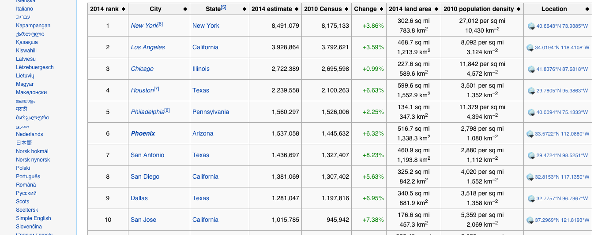
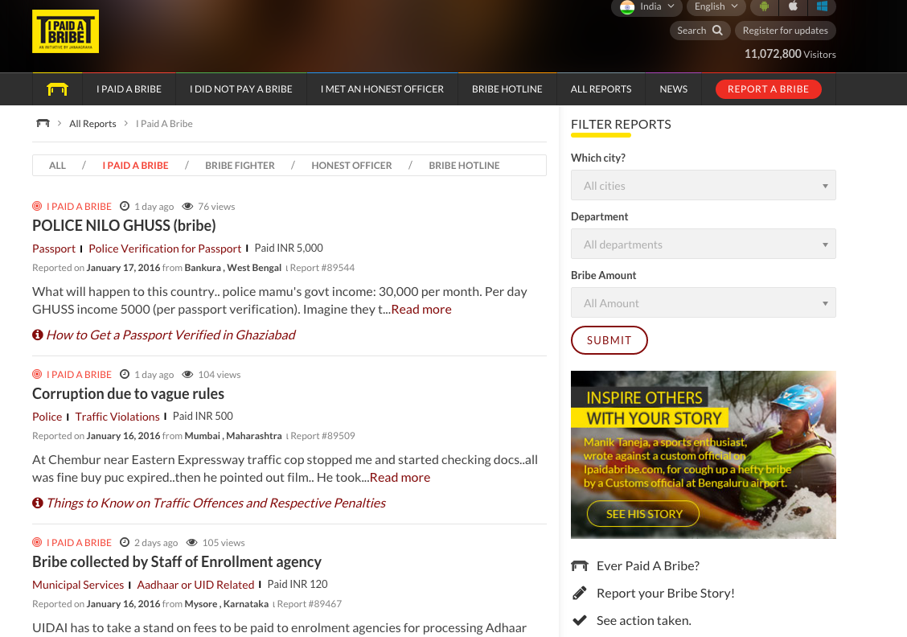
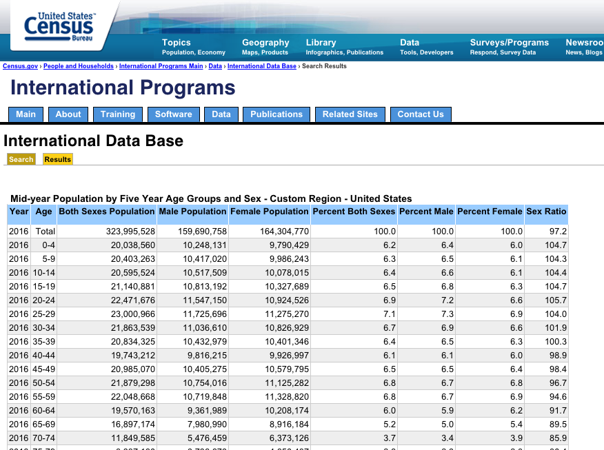

Scraping the web
========================================================
author: Pablo Barberá
date: January 22, 2016
incremental: true

Scraping the web: what? why?
========================================================

An increasing amount of data is available on the web:

- Election results, budget allocations, legislative speeches...
- Social media data, newspaper articles, press releases...
- Geographic information, weather forecasts...

These data are often provided in an __unstructured format__.

Web scraping is the process of extracting this information automatically and transforming it into a structured dataset.

Scraping the web: two approaches
========================================================

Two different scenarios:

1. Screen scraping: extract data from source code of website, with html parser and/or regular expressions
  - `rvest` package
2. Web APIs (application programming interfaces): a set of structure http requests that return JSON or XML data
  - [`httr`](https://cran.r-project.org/web/packages/rvest/index.html) to construct API requests
  - packages specific to each API:  [`weatherData`](https://cran.r-project.org/web/packages/weatherData/index.html), [`WDI`](https://cran.r-project.org/web/packages/WDI/index.html), [`Rfacebook`](https://cran.r-project.org/web/packages/Rfacebook/index.html)... Check CRAN Task View on [Web Technologies and Services](https://cran.r-project.org/web/views/WebTechnologies.html) for more examples

The rules of the game
========================================================

1. Respect the hosting site's wishes:
  - First, check if an API exists or if data are available for download
  - Some websites _disallow_ scrapers on their `robots.txt` files
2. Limit your bandwidth use:
  - Wait one or two seconds after each hit
  - Scrape only what you need, and just once (e.g. store the html file in disk, and then parse it)
3. When using APIs, read documentation
  - Is there a batch download option?
  - Are there any rate limits?
  - Can you share the data?

The art of web scraping
========================================================

Workflow:

1. Learn about structure of website
2. Build prototype code
3. Generalize: functions, loops, debugging
4. Data cleaning

Three main scenarios
========================================================
incremental: false

1. Data in table format

Three main scenarios
========================================================
incremental: false

2\. Data in unstructured format  

[www.ipaidabribe.com/reports/paid](www.ipaidabribe.com/reports/paid)

Three main scenarios
========================================================
incremental: false

3\. Data hidden behind web forms

[Candidates on 2015 Venezuelan parliamentary election](http://eligetucandidato.org/filtro/)

Three main scenarios
========================================================

1. Data in table format
  - Automatic extraction with `rvest`
2. Data in unstructured format
  - Element identification with `selectorGadget`
  - Aumatic extraction with `rvest`
3. Data hidden behind web forms
  - Automation of web browser behavior with `selenium`

Web data in table format
========================================================
incremental: false

[Population by Age Groups and Sex, U.S. Census](http://www.census.gov/population/international/data/idb/region.php?N=%20Results%20&T=10&A=separate&RT=0&Y=2016&R=-1&C=US)

