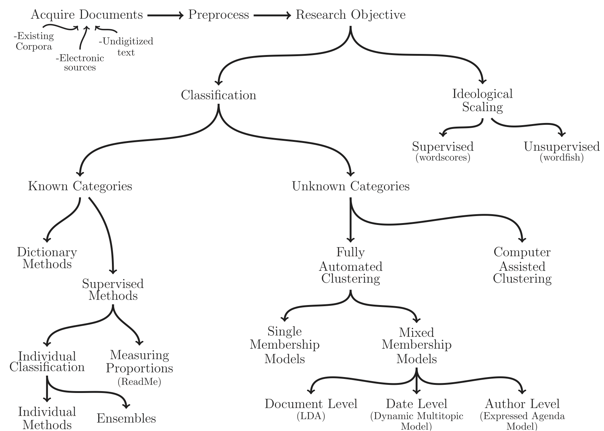

[Up To Schedule](../README.md#schedule)

# Automated Textual Analysis

Content analysis is the process of making sense out of visual, textual, and audio content. Textual analysis is a subset of content analysis which focuses on the written and spoken word. Until recently, most social science treatments of textual data has focused on close readings by humans of text. However, social scientists have adopted methods from the fields of natural language processing and machine learning to integrate automated textual analysis methods into social science practice. [Grimmer and Stewart (2013)](http://web.stanford.edu/~jgrimmer/tad2.pdf) provide a detailed outline of automated textual analysis methods within the social sciences, with a specific focus on political text.

In this workshop we will learn how to deal with text data sets using automated methods. We'll focus first on how to handle text on very basic level. We'll then move to basic searching of text using keyword searches and regular expressions. Lastly, we'll focus on machine learning methods of textual analysis, including classification and topic modeling. 

<!-- TK: Describe the packages we're relying on here -->

## Motivating Example: Understanding and Fighting Bullying with Machine Learning

As an example for these methods, we'll be using data and methods drawn from a [collaborative research project](http://research.cs.wisc.edu/bullying/) designed by a group of computer scientists and educational psychologists at the University of Wisconsin-Madison. The project focused on how to understand and combat cyberbullying by using the digital traces of bullying on Twitter. We use this example to connect text analysis to current research in education.

## Subsections

* [basic text handling](01_intro.Rmd)
* [keywords and regular expressions](02_keywords.Rmd)
* [machine learning methods](03_machine_learning.Rmd)
